# Auto-Notes Data Flow - Extension-Based Two-Pass Generation

## Overview

This document describes the data flow for the extension-based two-pass auto-note generation system. The approach uses the Chrome extension to read page content directly from the user's browser, avoiding scraping issues while achieving accurate note positioning.

## Key Principles

1. **Two-Pass Separation**: Creative generation (Pass 1) doesn't need DOM, position matching (Pass 2) doesn't need creativity
2. **Privacy First**: No persistent storage of page content, PII sanitization before processing
3. **User-Initiated**: All processing triggered by explicit user action
4. **Legal Compliance**: Extension reads content the user has access to, no external scraping

## System Architecture

```mermaid
sequenceDiagram
    participant User
    participant Extension as Chrome Extension<br/>(Content Script)
    participant Background as Extension<br/>(Background Service)
    participant Backend as Backend API<br/>(FastAPI)
    participant LLM as LLM Provider<br/>(Gemini API)
    participant DB as PostgreSQL<br/>Database

    Note over User,DB: Two-Pass Auto-Note Generation Flow

    %% Initialization Phase
    rect rgb(240, 248, 255)
        Note over User,Extension: Phase 1: User Initiation
        User->>Extension: Click "Generate Auto Notes" button
        Extension->>Extension: Check authentication status
        Extension->>Extension: Validate current page (not blocked/system page)
    end

    %% Pass 1: Creative Generation
    rect rgb(255, 240, 245)
        Note over Extension,LLM: Pass 1: Creative Content Generation (High Temp: 0.625)

        Extension->>Extension: Extract page metadata<br/>{url, title, meta_description}
        Extension->>Background: sendMessage({<br/>  action: "API_generateCreativeNotes",<br/>  pageInfo: metadata<br/>})

        Background->>Backend: POST /api/auto-notes/pages/{id}/generate-creative<br/>{<br/>  url: "https://example.com",<br/>  title: "Page Title",<br/>  custom_instructions: "optional"<br/>}

        Backend->>DB: Query page record<br/>SELECT * FROM pages WHERE id = ?
        DB-->>Backend: Page data {id, url, title, summary, context}

        Backend->>Backend: Build creative prompt using:<br/>- creative_generation.jinja2<br/>- page URL and title only<br/>- NO page content/HTML

        Backend->>LLM: Generate creative notes<br/>Prompt: ~2K tokens<br/>Temp: 0.625<br/>Max tokens: 8192

        LLM-->>Backend: Response with creative notes:<br/>[{<br/>  "highlighted_text": "approximate text",<br/>  "commentary": "insightful analysis",<br/>  "topic_hint": "main concept"<br/>}]

        Backend->>Backend: Parse JSON response<br/>Calculate costs<br/>Log token usage

        Backend-->>Background: Creative notes response<br/>{<br/>  notes: [...],<br/>  session_id: "abc123",<br/>  tokens_used: 2500<br/>}

        Background-->>Extension: Creative notes array
    end

    %% Content Extraction
    rect rgb(245, 255, 240)
        Note over Extension: Phase 2: DOM Content Extraction

        Extension->>Extension: extractPageContent() {<br/>  // Select text-bearing elements<br/>  querySelectorAll('p, h1-h6, li, td, th, blockquote, article, section')<br/>}

        Extension->>Extension: Process each element:<br/>- Extract textContent<br/>- Generate CSS selector<br/>- Generate XPath<br/>- Get bounding rect<br/>- Check visibility

        Extension->>Extension: Filter and clean:<br/>- Remove empty/short text (<20 chars)<br/>- Remove hidden elements<br/>- Remove script/style content<br/>- Deduplicate text

        Extension->>Extension: sanitizeForPrivacy():<br/>- Remove email patterns<br/>- Remove phone numbers<br/>- Remove SSN patterns<br/>- Remove credit cards<br/>- Strip form values

        Extension->>Extension: Structure content array:<br/>[{<br/>  text: "Actual paragraph text...",<br/>  cssSelector: "article > p:nth-child(3)",<br/>  xpath: "//article/p[3]",<br/>  tagName: "p",<br/>  parentSelector: "article.main-content",<br/>  charCount: 245,<br/>  wordCount: 42<br/>}]

        Extension->>Extension: Compress if needed:<br/>- Limit to 15K tokens worth<br/>- Prioritize by relevance<br/>- Keep diverse sections
    end

    %% Pass 2: Position Matching
    rect rgb(255, 248, 240)
        Note over Extension,LLM: Pass 2: Precise Position Matching (Low Temp: 0.1)

        Extension->>Background: sendMessage({<br/>  action: "API_matchNotePositions",<br/>  session_id: "abc123",<br/>  creative_notes: [...],<br/>  page_content: [...]<br/>})

        Background->>Backend: POST /api/auto-notes/match-positions<br/>{<br/>  session_id: "abc123",<br/>  notes: [creative_notes],<br/>  page_content: [dom_elements],<br/>  page_url: "https://..."<br/>}

        Backend->>Backend: Build positioning prompt using:<br/>- position_matching.jinja2<br/>- Creative notes from Pass 1<br/>- Actual DOM content<br/>- Instruction to match exactly

        Backend->>LLM: Match positions<br/>Prompt: ~20K tokens<br/>Temp: 0.1<br/>Max tokens: 4096<br/><br/>"Given these notes and this DOM,<br/>find exact unique selectors..."

        LLM-->>Backend: Positioned notes:<br/>[{<br/>  "highlighted_text": "Exact text from DOM",<br/>  "commentary": "From Pass 1",<br/>  "css_selector": "article#main > div.content > p:nth-child(7)",<br/>  "xpath": "//article[@id='main']/div[@class='content']/p[7]",<br/>  "confidence": 0.95<br/>}]

        Backend->>Backend: Process response:<br/>- Validate JSON<br/>- Calculate total costs<br/>- Generate batch_id

        Backend->>DB: INSERT INTO notes<br/>(page_id, user_id, content, highlighted_text,<br/>anchor_data, position_x, position_y,<br/>generation_batch_id, server_link_id)

        DB-->>Backend: Created note IDs

        Backend-->>Background: Final positioned notes<br/>{<br/>  notes: [{id, content, selectors...}],<br/>  generation_batch_id: "auto_xyz",<br/>  total_cost: 0.0025,<br/>  tokens_used: 22500<br/>}

        Background-->>Extension: Positioned notes response
    end

    %% Validation and Display
    rect rgb(240, 245, 255)
        Note over Extension,User: Phase 3: Local Validation & Display

        Extension->>Extension: For each note:<br/>validateSelectors() {<br/>  // Try CSS selector<br/>  document.querySelector(css_selector)<br/>  // Fallback to XPath<br/>  document.evaluate(xpath)<br/>  // Fallback to fuzzy text search<br/>}

        Extension->>Extension: Position calculation:<br/>- Get element boundingRect<br/>- Calculate optimal note position<br/>- Avoid overlaps<br/>- Ensure visibility

        Extension->>Extension: Create note elements:<br/>- Add to DOM<br/>- Apply styling<br/>- Add event handlers<br/>- Store in noteMap

        Extension->>Extension: Highlight text if found:<br/>- Create Range object<br/>- Add highlight spans<br/>- Track in highlightMap

        Extension->>Extension: Save to local storage:<br/>- Note data with positions<br/>- Server IDs for sync<br/>- Generation batch ID

        Extension->>User: Display notes on page<br/>Show success notification<br/>"Generated 12 study notes"
    end

    %% Error Handling Paths
    rect rgb(255, 230, 230)
        Note over Extension,Backend: Error Handling & Fallbacks

        alt Pass 1 Fails
            Backend-->>Extension: Error: LLM generation failed
            Extension->>User: Show error: "Could not generate notes"
        else Pass 2 Fails
            Backend-->>Extension: Error: Position matching failed
            Extension->>Extension: Use approximate positioning<br/>Display with warning
        else Selector Validation Fails
            Extension->>Extension: fallbackToTextSearch():<br/>- Search for text fragment<br/>- Use first match<br/>- Mark as "approximate"
        else Content Too Large
            Extension->>Extension: Chunk content<br/>Multiple Pass 2 requests<br/>Merge results
        end
    end

    %% Batch Operations
    rect rgb(250, 250, 240)
        Note over User,DB: Batch Management

        User->>Extension: Click "Remove Generated Notes"
        Extension->>Background: Delete batch request
        Background->>Backend: DELETE /api/auto-notes/batch/{id}
        Backend->>DB: UPDATE notes<br/>SET is_archived = true<br/>WHERE generation_batch_id = ?
        DB-->>Backend: 12 notes archived
        Backend-->>Extension: Success response
        Extension->>Extension: Remove notes from DOM
        Extension->>User: "Removed 12 auto-generated notes"
    end
```



## Data Structure Details

### Pass 1 Request (Creative Generation)
```json
{
  "page_id": 123,
  "template_type": "study_guide",
  "custom_instructions": "Focus on technical concepts",
  "metadata": {
    "url": "https://example.com/article",
    "title": "Article Title",
    "description": "Meta description if available"
  }
}
```

### Pass 1 Response (Creative Notes)
```json
{
  "session_id": "gen_abc123",
  "notes": [
    {
      "temp_id": "note_1",
      "highlighted_text": "Important concept mentioned in article",
      "commentary": "This concept is fundamental because...",
      "topic_hint": "machine learning",
      "importance": "high"
    }
  ],
  "metadata": {
    "tokens_used": 2500,
    "cost_usd": 0.0008,
    "model": "gemini-2.0-flash",
    "temperature": 0.625
  }
}
```

### DOM Content Structure (Extension → Backend)
```json
{
  "elements": [
    {
      "text": "Actual paragraph text from the page...",
      "cssSelector": "article.main-content > p:nth-child(3)",
      "xpath": "//article[@class='main-content']/p[3]",
      "tagName": "p",
      "parentSelector": "article.main-content",
      "attributes": {
        "class": "text-body",
        "data-paragraph": "3"
      },
      "context": {
        "previousText": "Previous paragraph snippet...",
        "nextText": "Next paragraph snippet..."
      },
      "metrics": {
        "charCount": 245,
        "wordCount": 42,
        "lineCount": 3
      }
    }
  ],
  "pageMetadata": {
    "totalElements": 147,
    "extractedElements": 52,
    "totalChars": 12453,
    "timestamp": "2025-01-09T10:30:00Z"
  }
}
```

### Pass 2 Response (Positioned Notes)
```json
{
  "notes": [
    {
      "id": 456,
      "content": "This concept is fundamental because...",
      "highlighted_text": "Exact text from the DOM that was matched",
      "position_x": 100,
      "position_y": 350,
      "anchor_data": {
        "elementSelector": "article#main > div.content > p:nth-child(7)",
        "elementXPath": "//article[@id='main']/div[@class='content']/p[7]",
        "selectionData": {
          "selectedText": "Exact text from the DOM",
          "startOffset": 45,
          "endOffset": 89
        },
        "confidence": 0.95,
        "match_type": "exact"
      },
      "generation_batch_id": "auto_xyz789",
      "server_link_id": "auto_xyz789_0"
    }
  ],
  "summary": {
    "total_notes": 12,
    "exact_matches": 10,
    "fuzzy_matches": 2,
    "failed_matches": 0,
    "total_tokens": 22500,
    "total_cost_usd": 0.0025
  }
}
```

## Implementation Components

### Extension Components

#### Content Extraction Function
```javascript
function extractPageContent() {
  const elements = [];
  const textSelectors = 'p, h1, h2, h3, h4, h5, h6, li, td, th, blockquote, article, section';

  document.querySelectorAll(textSelectors).forEach(el => {
    if (!isElementVisible(el)) return;

    const text = el.textContent.trim();
    if (text.length < 20) return;

    elements.push({
      text: text,
      cssSelector: generateCSSSelector(el),
      xpath: generateXPath(el),
      tagName: el.tagName.toLowerCase(),
      parentSelector: el.parentElement ? generateCSSSelector(el.parentElement) : null,
      charCount: text.length,
      wordCount: text.split(/\s+/).length
    });
  });

  return elements;
}
```

#### Privacy Sanitization
```javascript
function sanitizeForPrivacy(content) {
  // Remove PII patterns
  const patterns = {
    email: /[a-zA-Z0-9._%+-]+@[a-zA-Z0-9.-]+\.[a-zA-Z]{2,}/g,
    phone: /(\+\d{1,3}[-.\s]?)?\(?\d{1,4}\)?[-.\s]?\d{1,4}[-.\s]?\d{1,9}/g,
    ssn: /\d{3}-\d{2}-\d{4}/g,
    creditCard: /\d{4}[-\s]?\d{4}[-\s]?\d{4}[-\s]?\d{4}/g
  };

  let sanitized = content;
  Object.values(patterns).forEach(pattern => {
    sanitized = sanitized.replace(pattern, '[REDACTED]');
  });

  return sanitized;
}
```

### Backend Components

#### Two-Pass Service Methods
```python
async def generate_creative_notes(
    self,
    page_id: int,
    user_id: int,
    template_type: str = "study_guide",
    custom_instructions: Optional[str] = None
) -> Dict:
    """
    Pass 1: Generate creative notes without DOM access.
    Uses high temperature (0.625) for creativity.
    """
    # Implementation details...

async def match_note_positions(
    self,
    session_id: str,
    notes: List[Dict],
    page_content: List[Dict],
    page_url: str
) -> Dict:
    """
    Pass 2: Match notes to exact DOM positions.
    Uses low temperature (0.1) for precision.
    """
    # Implementation details...
```

## Cost Analysis

### Token Usage per Page
- **Pass 1 (Creative)**:
  - Input: ~2K tokens (URL, title, instructions)
  - Output: ~2K tokens (creative notes)
  - Cost: ~$0.0008

- **Pass 2 (Positioning)**:
  - Input: ~20K tokens (DOM content + notes)
  - Output: ~1K tokens (positioned notes)
  - Cost: ~$0.0017

- **Total Cost**: ~$0.0025 per page (quarter of a cent)

### Token Limits
- Maximum DOM content: 15K tokens
- Maximum notes per generation: 15
- Total context window: 32K tokens (Gemini 2.0 Flash)

## Privacy & Legal Considerations

### Privacy Protection
1. **No Persistent Storage**: Page content is never stored in database
2. **PII Sanitization**: Emails, phones, SSNs removed before processing
3. **User-Initiated Only**: No automatic or background processing
4. **Local Validation**: Selectors validated client-side, no round-trips

### Legal Compliance
1. **User's Own Content**: Extension reads what user has access to
2. **No External Scraping**: No server-side web requests
3. **Transparent Processing**: User sees what will be generated
4. **Batch Deletion**: Easy removal of all generated notes

## Error Handling & Fallbacks

### Fallback Strategy Hierarchy
1. **Primary**: CSS selector matching
2. **Secondary**: XPath expression matching
3. **Tertiary**: Fuzzy text search
4. **Final**: Absolute positioning at top of viewport

### Error States
- **Authentication Failed**: Prompt user to sign in
- **Page Too Large**: Chunk and process in batches
- **LLM Timeout**: Retry with exponential backoff
- **Invalid Selectors**: Fall back to text search
- **No Matches Found**: Display notes with warning

## Performance Optimizations

### Caching Strategy
- Cache creative notes during session
- Reuse DOM extraction for multiple operations
- Store selector validation results

### Size Limits
- Maximum DOM elements: 500
- Maximum text per element: 1000 chars
- Maximum total payload: 100KB
- Compression: gzip for large payloads

## Future Enhancements

1. **Streaming Generation**: Stream notes as they're generated
2. **Progressive Enhancement**: Show notes as soon as positioned
3. **Collaborative Notes**: Share auto-generated study guides
4. **Template Library**: Multiple generation templates
5. **ML Position Learning**: Learn from user corrections
6. **Offline Mode**: Generate notes without server connection

## Monitoring & Analytics

### Metrics to Track
- Generation success rate
- Average positioning accuracy
- Token usage per page type
- User satisfaction (keep/delete ratio)
- Performance timing for each phase

### Logging Points
1. Extension: User initiation, DOM extraction time
2. Backend: LLM latency, token usage, costs
3. Database: Batch creation, deletion rates

## Testing Strategy

### Unit Tests
- DOM extraction accuracy
- Selector generation uniqueness
- PII sanitization completeness
- JSON parsing robustness

### Integration Tests
- End-to-end flow with mock LLM
- Error handling paths
- Batch operations
- Authentication flows

### User Acceptance Testing
- Various page types (articles, docs, forums)
- Different content lengths
- Multiple languages
- Dynamic vs static content
